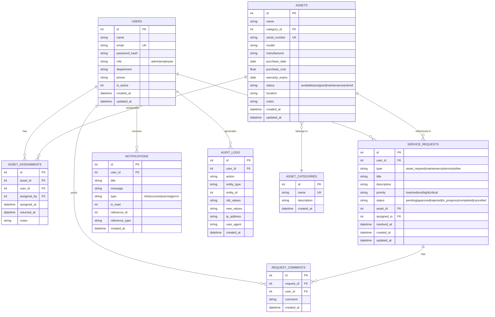

# AssetFlow — Office Asset Tracker

A full-stack web application for digitizing office asset tracking and employee service request management. Employees raise requests for IT assets and office services while administrators manage inventory, approvals, assignments, and reporting.

---

## Technology Stack

| Layer | Technology |
|-------|-----------|
| **Backend** | Node.js, Express.js (REST API) |
| **Database** | SQLite via sql.js (in-process, file-persisted) |
| **Authentication** | JWT (JSON Web Tokens) with bcrypt password hashing |
| **Frontend** | Vanilla JavaScript SPA (hash-based routing) |
| **Styling** | Custom CSS with glassmorphism design system |
| **API Docs** | Swagger / OpenAPI 3.0 |
| **Logging** | Winston + Morgan |
| **Validation** | express-validator |

---

## Architecture Diagram

```
┌──────────────────────────────────────────────────────────────────┐
│                         CLIENT BROWSER                           │
│  ┌─────────┐ ┌──────────┐ ┌────────┐ ┌──────┐ ┌──────────────┐ │
│  │ Auth JS │ │Dashboard │ │Assets  │ │Reqs  │ │Notifications │ │
│  │         │ │    JS    │ │   JS   │ │  JS  │ │     JS       │ │
│  └────┬────┘ └────┬─────┘ └───┬────┘ └──┬───┘ └──────┬───────┘ │
│       │           │           │         │             │          │
│       └───────────┴───────────┴─────────┴─────────────┘          │
│                          │                                       │
│                    API Client (api.js)                            │
│                 JWT in Authorization Header                      │
└──────────────────────────┼──────────────────────────────────────┘
                           │ HTTPS
┌──────────────────────────┼──────────────────────────────────────┐
│                    EXPRESS SERVER (:5000)                        │
│                           │                                      │
│  ┌────────────────────────┼──────────────────────────────────┐  │
│  │              MIDDLEWARE LAYER                              │  │
│  │  helmet → cors → morgan → express.json → auth → validate  │  │
│  └────────────────────────┼──────────────────────────────────┘  │
│                           │                                      │
│  ┌────────────────────────┼──────────────────────────────────┐  │
│  │                ROUTES (/api/*)                             │  │
│  │  auth  │ users │ assets │ requests │ dashboard │ reports  │  │
│  └────────┴───────┴────────┴──────────┴───────────┴──────────┘  │
│                           │                                      │
│  ┌────────────────────────┼──────────────────────────────────┐  │
│  │             CONTROLLER LAYER                               │  │
│  │  authController  dashboardController  assetController ...  │  │
│  └────────────────────────┼──────────────────────────────────┘  │
│                           │                                      │
│  ┌────────────────────────┼──────────────────────────────────┐  │
│  │               SERVICE LAYER                                │  │
│  │  authService  │  assetService  │  requestService           │  │
│  │  Business logic, validation, notifications, audit logs    │  │
│  └────────────────────────┼──────────────────────────────────┘  │
│                           │                                      │
│  ┌────────────────────────┼──────────────────────────────────┐  │
│  │                MODEL / DATA LAYER                          │  │
│  │  userModel │ assetModel │ requestModel │ notificationModel │  │
│  │                        │                                   │  │
│  │                  db-helper.js (sql.js)                     │  │
│  └────────────────────────┼──────────────────────────────────┘  │
│                           │                                      │
│                    ┌──────┴──────┐                              │
│                    │   SQLite    │                              │
│                    │ (file: .db) │                              │
│                    └─────────────┘                              │
└──────────────────────────────────────────────────────────────────┘
```

### Layered Architecture

```
src/
├── config/         Database init, seed data, swagger spec
├── middleware/      Auth (JWT), error handler, validation, audit
├── models/         Data access layer (SQL queries)
├── services/       Business logic layer
├── controllers/    Request/response handling
├── routes/         Route definitions & middleware composition
├── utils/          Logger, helpers, db-helper
└── server.js       Entry point
```

---

## Entity-Relationship Diagram (ERD)



---

## Features

### Authentication & Authorization
- JWT-based login/register with bcrypt password hashing
- Role-based access control (Admin / Employee)
- Token validation middleware on protected routes
- Password change functionality

### Employee Management (Admin)
- CRUD operations for user accounts
- Role assignment (admin/employee)
- Account activation/deactivation
- Department and contact management

### Asset Management
- Full CRUD for assets (name, category, serial, model, manufacturer, cost)
- Asset categories management
- Assign assets to employees
- Return assets from employees
- Asset status tracking (available, assigned, maintenance, retired)
- Assignment history per asset

### Service Request Module
- Employees submit requests (asset request, maintenance, service, other)
- Priority levels (low, medium, high, critical)
- Status workflow: pending → approved → in_progress → completed
- Admin can approve, reject, or update request status
- Discussion threads / comments on each request

### Dashboard
- **Admin**: Total assets, active employees, pending requests, total value, recent requests, asset status breakdown
- **Employee**: My assets count, open requests, unread notifications, recent activity

### Notifications
- Real-time notification badge in topbar
- Per-user notification list with read/unread status
- Mark all as read
- Notifications auto-created on asset assignments, status changes

### Reports & Analytics (Admin)
- Asset inventory report (filter by category, purchase date range)
- Service request analytics (by status, type, date range)
- Summary statistics (value, distribution, resolution time)

### Search & Filtering
- Search across all entities (name, serial, email)
- Filter by status, category, role, date ranges
- All tables support pagination

### Audit Logs (Admin)
- Track all system activity (login, create, update, delete, assign, return)
- Filter by entity type, action, date range
- IP address and user agent tracking

---

## API Documentation

Full Swagger/OpenAPI documentation available at:

```
http://localhost:5000/api-docs
```

### API Endpoints Summary

| Method | Endpoint | Auth | Description |
|--------|----------|------|-------------|
| POST | `/api/auth/login` | Public | User login |
| POST | `/api/auth/register` | Public | User registration |
| GET | `/api/auth/me` | User | Get current user profile |
| POST | `/api/auth/change-password` | User | Change password |
| GET | `/api/users` | Admin | List all users (paginated, filtered) |
| POST | `/api/users` | Admin | Create user |
| GET | `/api/users/:id` | Admin | Get user details |
| PUT | `/api/users/:id` | Admin | Update user |
| DELETE | `/api/users/:id` | Admin | Deactivate user |
| GET | `/api/users/:id/assets` | User | Get user's assigned assets |
| GET | `/api/assets` | User | List assets (filtered) |
| POST | `/api/assets` | Admin | Create asset |
| GET | `/api/assets/stats` | Admin | Asset statistics |
| GET | `/api/assets/:id` | User | Get asset details |
| PUT | `/api/assets/:id` | Admin | Update asset |
| DELETE | `/api/assets/:id` | Admin | Delete asset |
| POST | `/api/assets/:id/assign` | Admin | Assign asset to user |
| POST | `/api/assets/:id/return` | Admin | Return asset |
| GET | `/api/assets/:id/history` | User | Assignment history |
| GET | `/api/assets/categories` | User | List categories |
| POST | `/api/assets/categories` | Admin | Create category |
| PUT | `/api/assets/categories/:id` | Admin | Update category |
| DELETE | `/api/assets/categories/:id` | Admin | Delete category |
| GET | `/api/requests` | User | List requests (filtered) |
| POST | `/api/requests` | User | Create request |
| GET | `/api/requests/:id` | User | Get request details |
| DELETE | `/api/requests/:id` | User | Cancel request |
| PUT | `/api/requests/:id/status` | Admin | Update request status |
| GET | `/api/requests/:id/comments` | User | Get comments |
| POST | `/api/requests/:id/comments` | User | Add comment |
| GET | `/api/dashboard/stats` | User | Dashboard statistics |
| GET | `/api/reports/assets` | Admin | Asset report |
| GET | `/api/reports/requests` | Admin | Request report |
| GET | `/api/audit-logs` | Admin | Audit logs |
| GET | `/api/notifications` | User | User notifications |
| PUT | `/api/notifications/read-all` | User | Mark all read |
| PUT | `/api/notifications/:id/read` | User | Mark one read |

---

## Setup Instructions

### Prerequisites
- **Node.js** v16 or higher
- **npm** v7 or higher

### Installation

```bash
# Clone the repository
git clone <repository-url>
cd office-asset-tracker

# Install backend dependencies
cd backend
npm install

# Start the application
npm start
```

The server starts on **http://localhost:5000**.

### Development Mode

```bash
cd backend
npm run dev
```

Uses nodemon for auto-restart on file changes.

### Demo Credentials

| Role | Email | Password |
|------|-------|----------|
| Admin | `admin@example.com` | `Admin@123` |
| Employee | `alice@example.com` | `Employee@123` |
| Employee | `bob@example.com` | `Employee@123` |

---

## Project Structure

```
office-asset-tracker/
├── backend/
│   ├── server.js                 # Entry point
│   ├── package.json
│   ├── .env                      # Environment variables
│   ├── database/
│   │   ├── schema.sql            # Full database schema
│   │   └── office_assets.db      # SQLite database file
│   ├── logs/
│   │   ├── combined.log
│   │   └── error.log
│   └── src/
│       ├── app.js                # Express app setup
│       ├── config/
│       │   ├── database.js       # SQLite initialization
│       │   ├── seed.js           # Seed data
│       │   └── swagger.js        # Swagger/OpenAPI spec
│       ├── middleware/
│       │   ├── auth.js           # JWT authentication
│       │   ├── errorHandler.js   # Global error handler
│       │   ├── validate.js       # Input validation
│       │   └── auditMiddleware.js
│       ├── models/
│       │   ├── userModel.js
│       │   ├── assetModel.js
│       │   ├── categoryModel.js
│       │   ├── requestModel.js
│       │   ├── notificationModel.js
│       │   └── auditModel.js
│       ├── services/
│       │   ├── authService.js
│       │   ├── assetService.js
│       │   └── requestService.js
│       ├── controllers/
│       │   ├── authController.js
│       │   ├── userController.js
│       │   ├── assetController.js
│       │   ├── requestController.js
│       │   ├── dashboardController.js
│       │   └── notificationController.js
│       ├── routes/
│       │   ├── auth.js
│       │   ├── users.js
│       │   ├── assets.js
│       │   ├── requests.js
│       │   └── misc.js
│       └── utils/
│           ├── logger.js
│           ├── helpers.js
│           └── db-helper.js
├── frontend/
│   ├── index.html                # SPA shell
│   ├── css/
│   │   └── style.css             # Glassmorphism design system
│   └── js/
│       ├── api.js                # API client & utilities
│       ├── auth.js               # Login/register forms
│       ├── app.js                # SPA router & navigation
│       ├── dashboard.js          # Admin & employee dashboards
│       ├── assets.js             # Asset inventory & management
│       ├── requests.js           # Service requests
│       ├── employees.js          # Employee directory (admin)
│       ├── reports.js            # Reports & analytics
│       ├── notifications.js      # Notifications
│       ├── audit.js              # Audit logs
│       └── profile.js            # Profile & settings
├── docs/                         # Documentation & diagrams
├── .gitignore
└── README.md
```

---

## Request Status Workflow

```
pending ──────→ approved ──────→ in_progress ──────→ completed
  │                │                   │
  ├──→ rejected    ├──→ cancelled      └──→ cancelled
  └──→ cancelled
```

---

## Security Features

- Passwords hashed with bcryptjs (12 salt rounds)
- JWT tokens with 7-day expiry
- Helmet security headers
- CORS whitelist for frontend origins
- Input validation on all endpoints via express-validator
- Role-based authorization middleware
- Audit logging for all major actions
- SQL injection prevention via parameterized queries

---

## Database

The application uses SQLite via sql.js (compiled to WebAssembly). The database is initialized on startup with the schema from `backend/database/schema.sql`. Seed data is inserted automatically when the database is empty. The database is persisted to disk every 30 seconds.

---

## License

MIT
