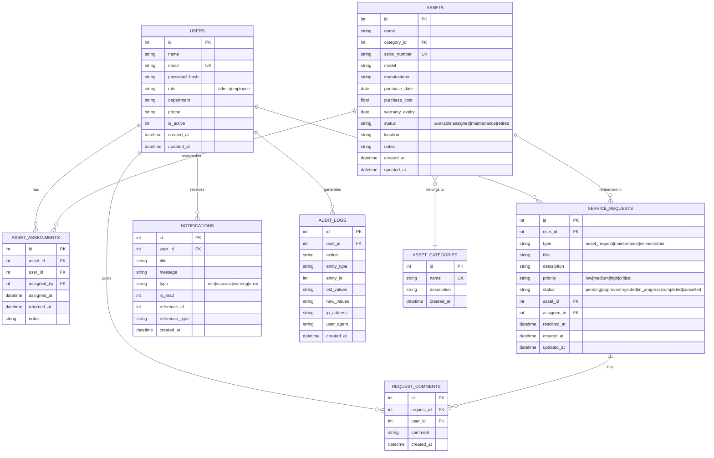

# Entity-Relationship Diagram — Office Asset Tracker

## Relationships

| Table A | Table B | Relationship | Description |
|---------|---------|-------------|-------------|
| users | asset_assignments | 1:N | A user can have many asset assignments |
| assets | asset_assignments | 1:N | An asset can be assigned many times |
| users | service_requests | 1:N | A user creates many service requests |
| assets | service_requests | 1:N | A request may reference an asset |
| service_requests | request_comments | 1:N | A request has many comments |
| users | request_comments | 1:N | A user posts many comments |
| users | notifications | 1:N | A user receives many notifications |
| users | audit_logs | 1:N | Actions are attributed to users |
| asset_categories | assets | 1:N | A category contains many assets |

## Indexes

- `idx_assets_status` on assets(status)
- `idx_assets_category` on assets(category_id)
- `idx_requests_user` on service_requests(user_id)
- `idx_requests_status` on service_requests(status)
- `idx_requests_type` on service_requests(type)
- `idx_notifications_user` on notifications(user_id, is_read)
- `idx_audit_entity` on audit_logs(entity_type, entity_id)
- `idx_assignments_asset` on asset_assignments(asset_id)
- `idx_assignments_user` on asset_assignments(user_id)
